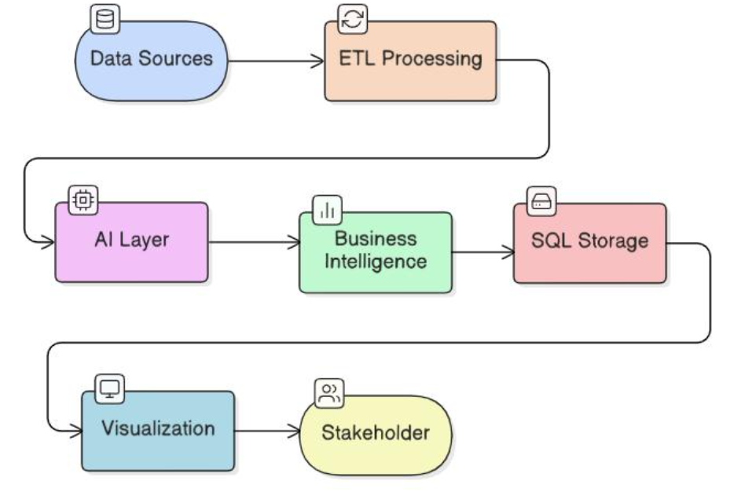
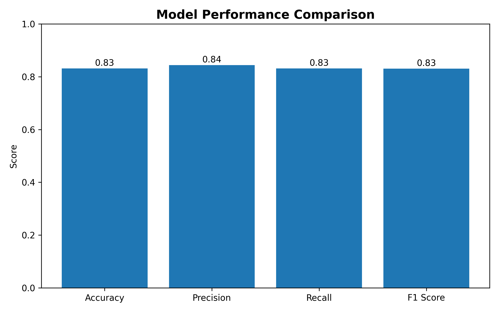
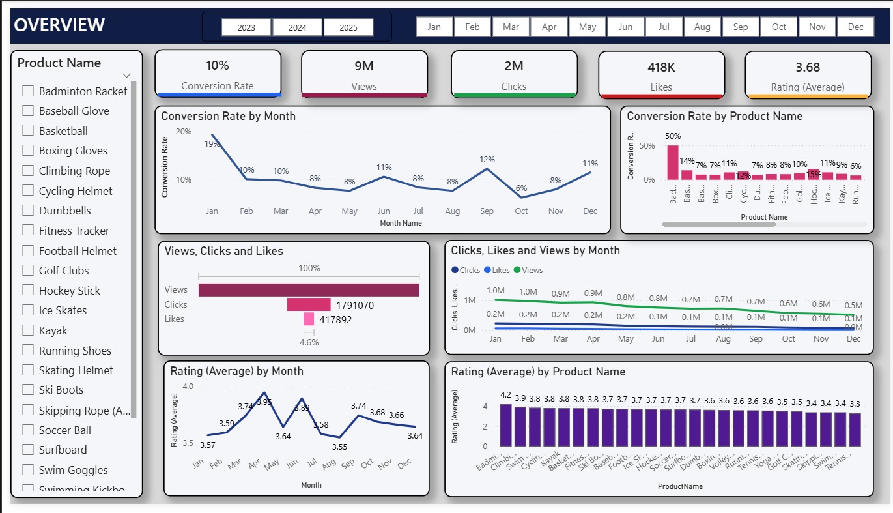
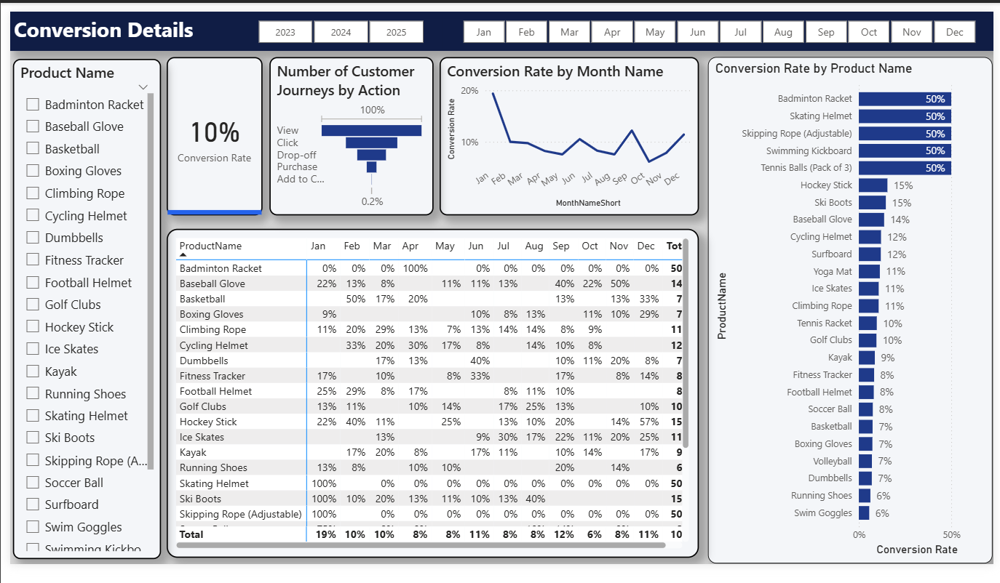
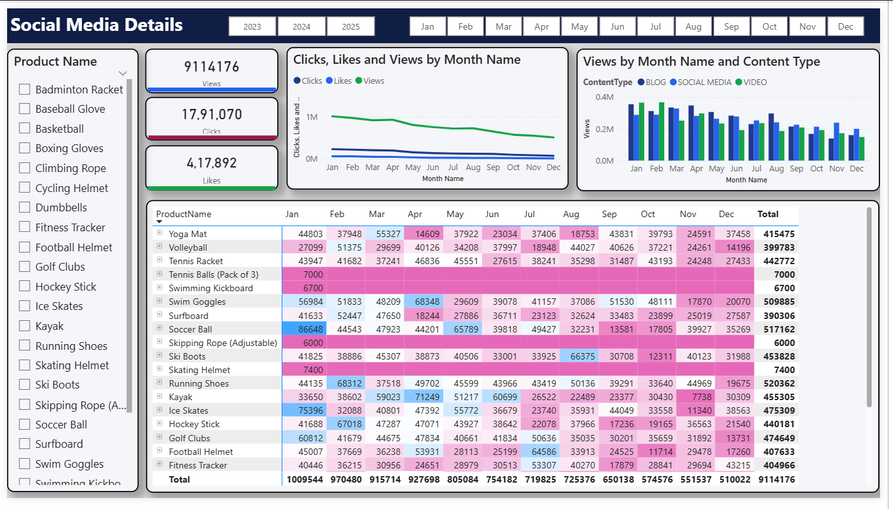
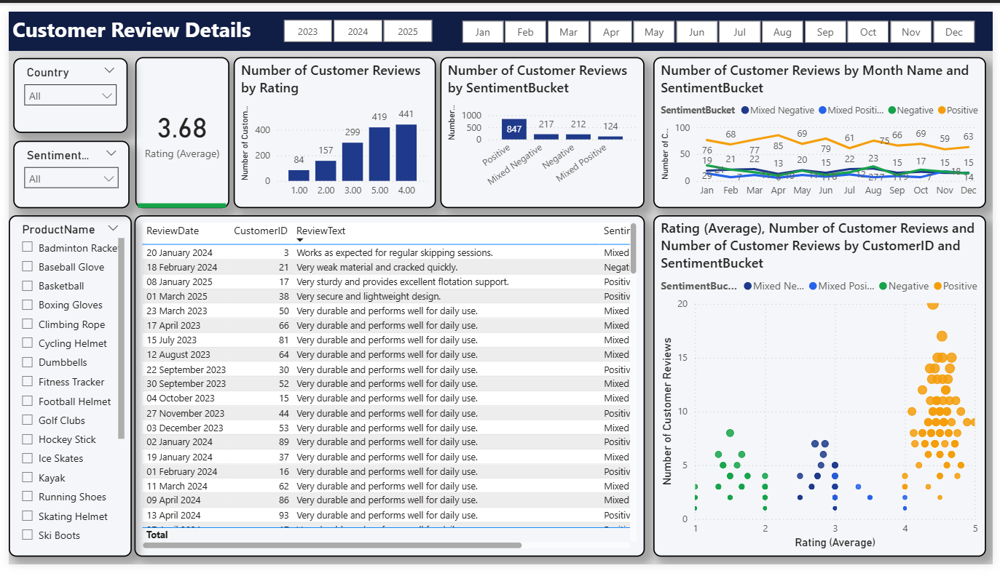
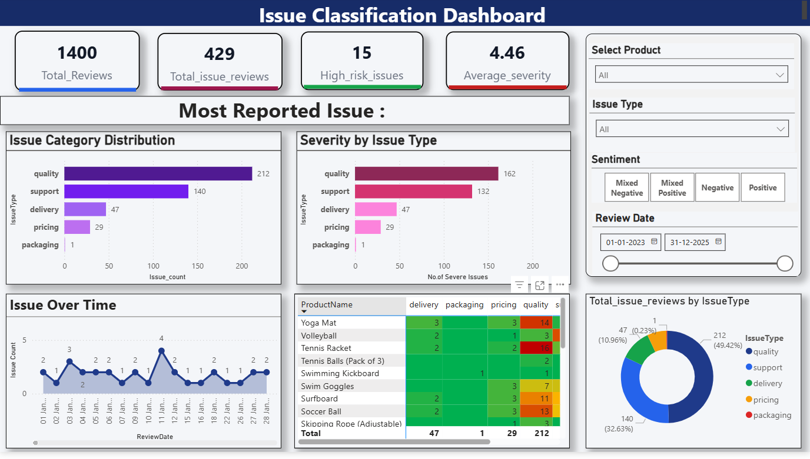
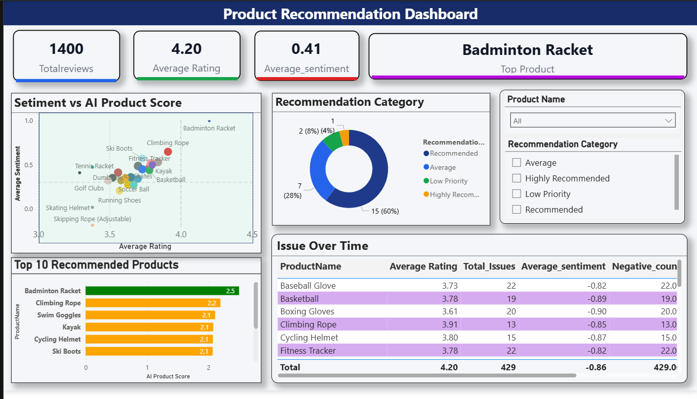
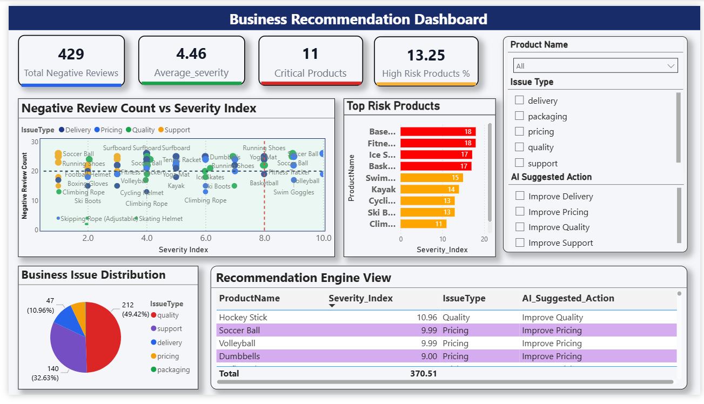

# 🚀 AI-Powered BI Tool for Customer Sentiment Analysis

<div align="center">

### 🤖 Transforming Customer Feedback into Business Intelligence

An AI-powered Business Intelligence platform that combines **Natural Language Processing (NLP)**, **Machine Learning**, **Transformer-based Deep Learning (DistilBERT)**, **SQL Analytics**, and **Power BI Dashboards** to convert customer feedback into actionable business insights.


</div>

---

# 📌 Project Overview

Customer feedback contains valuable information about product quality, customer satisfaction, and business performance. However, manually analyzing thousands of reviews is time-consuming and inefficient.

This project presents an AI-powered Business Intelligence platform that combines NLP, Transformer-based Deep Learning, SQL Analytics, and Power BI dashboards to automate customer sentiment analysis and generate actionable business insights.

The system processes customer reviews, identifies sentiments, classifies customer issues, calculates severity scores, ranks products, and visualizes results through interactive dashboards.

### Key Outcomes

- Automated sentiment classification
- AI-powered issue detection
- Product ranking system
- Severity and risk analysis
- Business recommendation engine
- Interactive Power BI dashboards

---

# 📄 Research Publication

Our research paper titled:

**"AI Powered Business Intelligence Tool for Customer Sentiment Analysis"**

has been accepted at:

**6th International Conference on Intelligent Vision and Computing (ICIVC 2026)**

and will be published in the:

**Springer Lecture Notes in Networks and Systems (LNNS) Series (SCOPUS Indexed).**

---

# 🎯 Project Objectives

- Automate customer feedback analysis
- Reduce manual review processing effort
- Improve business intelligence reporting
- Identify customer satisfaction trends
- Generate actionable business insights
- Apply Transformer-based AI models for advanced sentiment analysis

---

# ✨ Key Features

## 🔍 Sentiment Analysis

- Analyze customer reviews using NLP techniques
- Detect Positive, Negative, and Neutral sentiments
- Generate sentiment scores using DistilBERT

## 🤖 AI-Based Issue Classification

- Identify customer concerns automatically
- Categorize product issues
- Generate severity-based classifications

## 📊 Business Intelligence Analytics

- Product AI Scores
- Product Ranking System
- Severity Index Calculation
- Risk Category Detection
- Trend Analysis

## 🗄️ SQL Analytics Storage

- Structured analytics storage
- Optimized reporting layer
- Dashboard-ready datasets

## 📈 Dashboard Visualization

- Interactive Power BI dashboards
- KPI monitoring
- Business insights visualization

---

# 🛠️ Technologies Used

| Category | Technologies |
|----------|--------------|
| Programming | Python |
| AI & ML | Machine Learning, Deep Learning |
| NLP | NLTK, TextBlob |
| Transformer Models | DistilBERT |
| Database | SQL Server / MySQL |
| Visualization | Power BI |
| Libraries | Pandas, NumPy, Scikit-learn, Hugging Face Transformers |

---

# 📊 Dataset & Analytics Pipeline

```text
Customer Reviews
        ↓
Data Cleaning & Preprocessing
        ↓
NLP Feature Engineering
        ↓
Sentiment Analysis
        ↓
DistilBERT Issue Classification
        ↓
Severity Score Generation
        ↓
SQL Analytics Storage
        ↓
Power BI Dashboard Reporting
        ↓
Business Recommendations
```

This pipeline transforms unstructured customer feedback into structured business intelligence.

---
# 🏗️ System Workflow Architecture

The platform follows an end-to-end analytics pipeline that transforms raw customer feedback into business intelligence insights.



### Workflow Description

1. **Data Sources**
   - Customer reviews and feedback datasets are collected from structured data sources.

2. **ETL Processing**
   - Data is extracted, cleaned, transformed, and prepared for analysis.

3. **AI Layer**
   - NLP techniques and the fine-tuned DistilBERT model perform sentiment analysis and issue classification.

4. **Business Intelligence Layer**
   - Business metrics such as sentiment scores, severity index, product rankings, and risk categories are generated.

5. **SQL Storage**
   - Processed analytics are stored in a structured SQL database for efficient querying and reporting.

6. **Visualization**
   - Power BI dashboards visualize key insights, trends, KPIs, and recommendations.

7. **Stakeholder Decision Support**
   - Business users and stakeholders leverage the generated insights to support data-driven decision-making.


---

# 🤖 AI Model

The project uses a fine-tuned DistilBERT Transformer model for:

- Customer Sentiment Analysis
- Customer Issue Classification
- Severity Prediction Support
- Business Recommendation Generation

### Why DistilBERT?

- Lightweight Transformer Architecture
- Faster Training and Inference
- High NLP Accuracy
- Efficient for Large Review Datasets

---

# 📈 Fine-Tuned Issue Classification Model Performance

The following results represent the performance of the **Fine-Tuned DistilBERT Issue Classification Model** used for customer issue detection and categorization.

This evaluation does **not represent the performance of the entire BI platform**, dashboards, SQL analytics layer, or sentiment analysis pipeline. It specifically measures the effectiveness of the issue classification model.

### Evaluation Metrics

| Metric | Score |
|----------|----------|
| Accuracy | 83% |
| Precision | 84% |
| Recall | 83% |
| F1 Score | 83% |

### Performance Visualization



### Metric Interpretation

#### Accuracy (83%)

The model correctly classified approximately 83% of customer issues across all categories.

#### Precision (84%)

When the model predicted a particular issue category, it was correct 84% of the time, indicating reliable classifications with fewer false positives.

#### Recall (83%)

The model successfully identified 83% of actual issue instances present in the dataset.

#### F1 Score (83%)

The F1 Score demonstrates a balanced trade-off between Precision and Recall, indicating stable and consistent classification performance.

### Evaluation Summary

The fine-tuned DistilBERT model achieved balanced performance across all evaluation metrics, making it suitable for automated customer issue classification within the Business Intelligence platform.

The model serves as the AI engine responsible for transforming unstructured customer complaints into structured issue categories that can be analyzed through SQL analytics and Power BI dashboards.
---

# 📊 Dashboard Modules

## 1️⃣ Overview Dashboard

### Features

- Conversion Trends
- Average Ratings
- Views, Clicks & Likes
- Product-wise Analysis



---

## 2️⃣ Conversion Details Dashboard

### Features

- Conversion Funnel
- Product Conversion Rates
- Monthly Trends
- Customer Journey Tracking



---

## 3️⃣ Social Media Details Dashboard

### Features

- Likes Analysis
- View Tracking
- Click Monitoring
- Content Performance



---

## 4️⃣ Customer Review Dashboard

### Features

- Rating Analysis
- Sentiment Distribution
- Customer Reviews
- Review Trends



---

## 5️⃣ Issue Classification Dashboard

### Features

- Issue Distribution
- Severity Analysis
- Issue Trends
- Product Issue Tracking



---

## 6️⃣ Product Recommendation Dashboard

### Features

- Product Ranking
- AI Product Scores
- Rating vs Sentiment Analysis
- Recommendation Categories



---

## 7️⃣ Business Recommendation Dashboard

### Features

- High-Risk Products
- Severity Index
- AI Suggested Actions
- Negative Review Analysis



---

# 📂 Project Structure

```text
AI-Powered-BI-Tool-for-Customer-Sentiment-Analysis/
│
├── Backup/
├── CSAdb/
├── csv files/
├── dataset tables/
├── output_images/
│   ├── overview_snapshot.png
│   ├── conversion_details_snapshot.png
│   ├── s_m_details_snapshot.png
│   ├── customer_review_details_snapshot.png
│   ├── issue_classification.png
│   ├── product_recommendation_dashboard.png
│   ├── business_recommendation.png
│   └── model_performance_comparison.png
│
├── py src/
├── sql_queries/
├── system_performance_graphs/
│
├── final_bi_dashboard.pbix
├── model_evaluation_results.txt
├── traintestsplit_summary.txt
├── system_workflow.png
└── README.md
```

### Folder Description

| Folder/File | Description |
|------------|-------------|
| Backup | Backup project files |
| CSAdb | Database-related resources |
| csv files | Raw and processed datasets |
| dataset tables | Structured analytical tables |
| output_images | Dashboard screenshots and model evaluation visuals |
| py src | Python source code |
| sql_queries | SQL scripts and analytical queries |
| system_performance_graphs | Additional performance visualizations |
| final_bi_dashboard.pbix | Power BI dashboard file |
| model_evaluation_results.txt | Model evaluation metrics |
| traintestsplit_summary.txt | Dataset split summary |
| system_workflow.png | End-to-end system workflow architecture |
| README.md | Project documentation |


---

# 📈 Output Insights

The system generates:

- Sentiment Distribution
- Product AI Scores
- Product Rankings
- Severity Index
- Risk Categories
- Issue Classification Reports
- Trend Analysis
- Business Recommendations

---

# 💼 Business Value

This platform helps organizations:

- Understand customer sentiment at scale
- Identify recurring customer issues
- Prioritize critical product problems
- Improve customer satisfaction
- Support data-driven business decisions
- Reduce manual review analysis effort

The system converts raw customer feedback into actionable business intelligence.

---

# 🎯 Skills Demonstrated

## Data Analytics

- Data Cleaning
- Data Transformation
- SQL Analytics
- KPI Design
- Dashboard Development
- Business Reporting

## Data Science

- Natural Language Processing (NLP)
- Sentiment Analysis
- Transformer Models
- DistilBERT
- Classification
- Model Evaluation

## Business Intelligence

- Power BI
- SQL Reporting
- Insight Generation
- Recommendation Systems
- Risk Analysis

---

# 🔮 Future Enhancements

- Real-Time Sentiment Monitoring
- Social Media Integration
- Multi-Language Sentiment Analysis
- Advanced Transformer Models
- Cloud Deployment
- Automated Recommendation Engine

---


# ⭐ Conclusion

The AI-Powered BI Tool for Customer Sentiment Analysis combines NLP, Machine Learning, DistilBERT, SQL Analytics, and Power BI to transform raw customer reviews into meaningful business intelligence. The platform enables organizations to understand customer sentiment, detect product issues, prioritize risks, and make informed data-driven decisions.

---

<div align="center">

### 🌟 If you found this project interesting, consider giving it a Star ⭐

</div>
